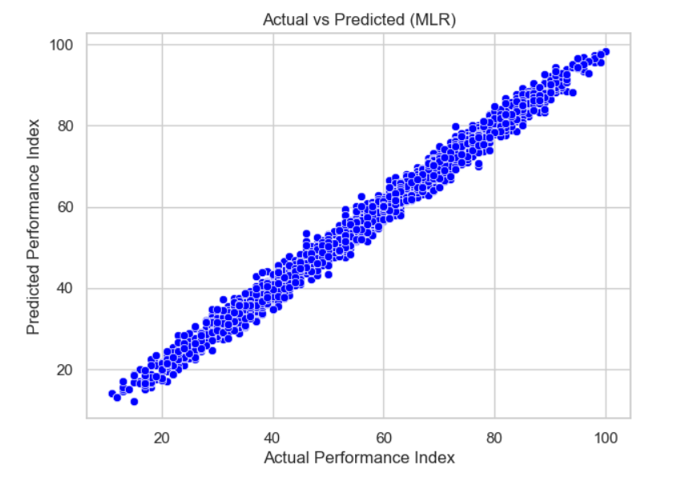
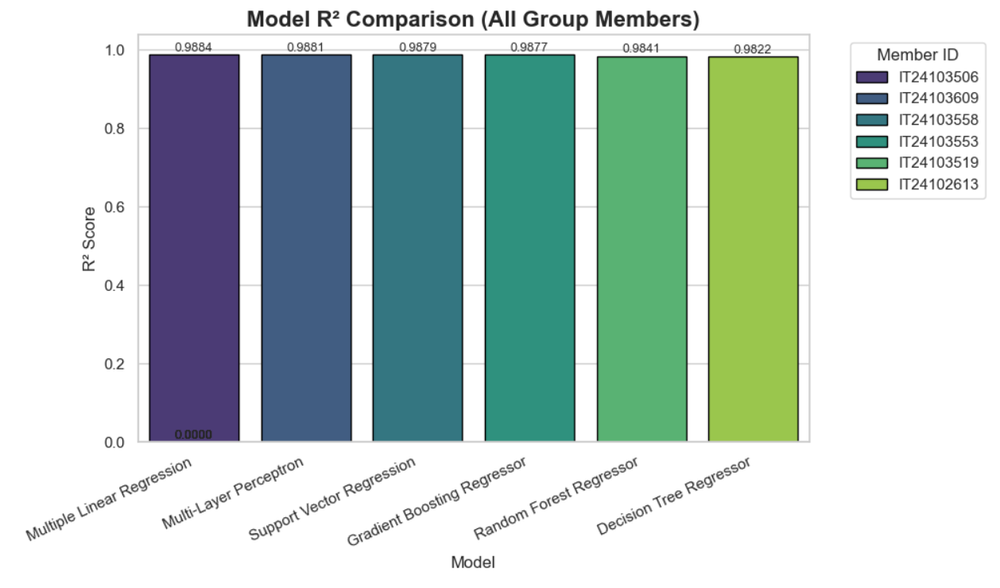

# Student Performance Prediction Using Machine Learning

## Overview

This project was developed as part of the Artificial Intelligence & Machine Learning module at the Sri Lanka Institute of Information Technology (SLIIT).

The objective of this project is to predict student academic performance using Machine Learning regression techniques. By analyzing academic and behavioral factors, the system estimates a student's Performance Index and evaluates multiple machine learning models to identify the most accurate predictor.

---

## Project Results

### All Model Comparison





---

## Objectives

* Analyze factors affecting student academic performance.
* Apply multiple machine learning regression algorithms.
* Compare model performance using standard evaluation metrics.
* Select the most suitable model for deployment.

---

## Dataset Information

**Dataset:** Student_Performance_cleaned.csv

### Features

* Hours Studied
* Previous Scores
* Extracurricular Activities
* Sleep Hours
* Sample Question Papers Practiced
* StudyEfficiency

**Target Variable:** Performance Index

---

## Machine Learning Models Evaluated

* Multiple Linear Regression (MLR)
* Random Forest Regressor
* Decision Tree Regressor
* Gradient Boosting Regressor
* Support Vector Regressor (SVR)
* Multi-Layer Perceptron (MLP)

---

## Evaluation Metrics

* Mean Absolute Error (MAE)
* Root Mean Squared Error (RMSE)
* R² Score (Coefficient of Determination)

---

## Results

| Model                       | MAE    | RMSE   | R²     |
| --------------------------- | ------ | ------ | ------ |
| Multiple Linear Regression  | 1.6466 | 2.0753 | 0.9884 |
| MLP Regressor               | 1.6707 | 2.1024 | 0.9881 |
| SVR                         | 1.6805 | 2.1220 | 0.9879 |
| Gradient Boosting Regressor | 1.7034 | 2.1418 | 0.9877 |
| Random Forest Regressor     | 1.9511 | 2.4345 | 0.9841 |
| Decision Tree Regressor     | 2.0435 | 2.5755 | 0.9822 |

### Final Selected Model

**Multiple Linear Regression (MLR)**

The model achieved the highest predictive performance with an R² score of approximately **98.84%**, demonstrating excellent accuracy and reliability.

---

## Technologies Used

* Python
* Jupyter Notebook
* Pandas
* NumPy
* Scikit-learn
* Matplotlib
* Seaborn
* Joblib

---

## Project Structure

```text
├── data/
├── notebooks/
├── results/
├── images/
├── group_pipeline.ipynb
├── Final_Report.pdf
└── README.md
```

---

## Team Members

| Member ID  | Model                       |
| ---------- | --------------------------- |
| IT24103506 | Multiple Linear Regression  |
| IT24103519 | Random Forest Regressor     |
| IT24103553 | Gradient Boosting Regressor |
| IT24103558 | Support Vector Regressor    |
| IT24103609 | Multi-Layer Perceptron      |
| IT24102613 | Decision Tree Regressor     |

---

## Conclusion

This project demonstrates the effective application of Machine Learning techniques for student performance prediction. Among the evaluated models, Multiple Linear Regression delivered the best balance of accuracy, interpretability, and computational efficiency, making it the preferred solution for this dataset.

---

**Developed as part of the Artificial Intelligence & Machine Learning Module**
**Faculty of Computing, Sri Lanka Institute of Information Technology (SLIIT)**
